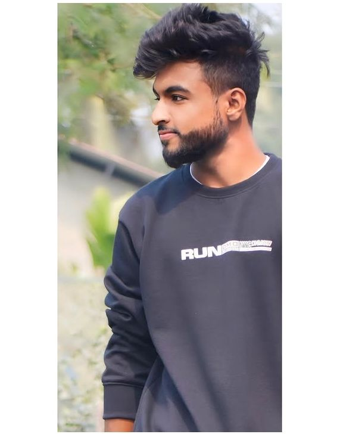

<h1 align="center">Hi 👋, I'm Shanjit Biswas</h1>

<h3 align="center">🚀 Aspiring Developer | Android Learner | Coding Enthusiast</h3>

  
  

  

---

## 🚀 About Me

- 🎓 Student passionate about technology  
- 💻 Learning **C++ , Java & Android Development**  
- 🌱 Improving problem-solving skills  
- 🤝 Open to learning & collaboration  

---

## 🛠️ Skills

  
  
  

---

## 📊 GitHub Stats

  
   
  

---

## 🔥 Streak Stats

  

---

## 🚀 Projects

- 📱 Android App (Coming Soon)  
- 💻 C++ Practice Programs  
- 🧠 Logic Building Projects  

---

## 🎯 Current Focus

- 📚 Learning Android Development  
- 💡 Building small projects  
- 🚀 Improving coding skills  

---

## 📬 Connect With Me

  

---

⭐ **Thanks for visiting my profile!**
